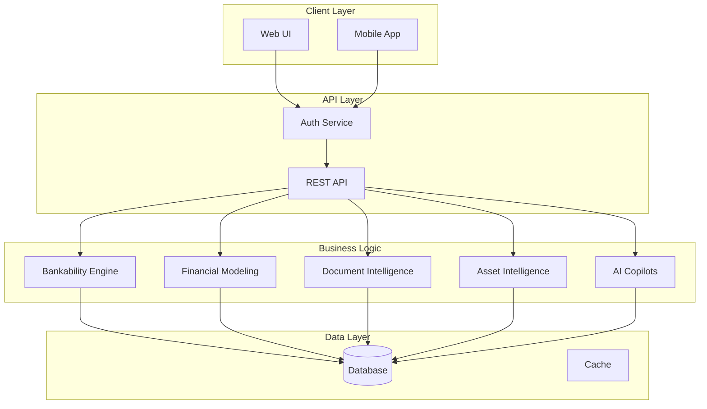

# Atlas

**Bankability & Asset Intelligence Operating System**

Atlas is a Next.js + TypeScript underwriting workspace for project-finance origination, diligence, bankability scoring, and lender-facing decision support.

[](https://github.com/your-org/atlas/actions)
[](https://www.typescriptlang.org/)
[](https://nextjs.org/)
[](LICENSE)

---

## Overview

Atlas provides a comprehensive platform for infrastructure and project finance teams to manage the entire deal lifecycle:

- **Deal Origination** — Pipeline management with scoring and triage
- **Document Intelligence** — Automated ingestion, classification, and evidence extraction
- **Bankability Scoring** — Multi-domain risk assessment with scenario analysis
- **Financial Modeling** — Scenario libraries, stress testing, and lender packs
- **Execution Tracking** — Digital twin for project controls
- **Asset Intelligence** — Telemetry, anomaly detection, and predictive maintenance
- **ESG & Compliance** — Permit tracking, obligations, and incident management
- **AI Copilots** — Evidence-grounded search and narrative generation

## Quick Start

```bash
# Prerequisites: Node.js 20+, pnpm

# Clone and install
git clone https://github.com/your-org/atlas.git
cd atlas
pnpm install

# Start development server
pnpm dev

# Open http://localhost:3000
```

### Demo Credentials

After seeding (`pnpm seed`), use these accounts:

| Email | Password | Role |
|-------|----------|------|
| `admin@atlas.dev` | `Atlas2026!` | org owner |
| `analyst@atlas.dev` | `Atlas2026!` | org member |
| `viewer@atlas.dev` | `Atlas2026!` | org viewer |

---

## Architecture

### System Design

```
┌─────────────────────────────────────────────────────────────────────┐
│                           Atlas Platform                             │
├─────────────────────────────────────────────────────────────────────┤
│  ┌─────────────┐  ┌─────────────┐  ┌─────────────┐  ┌────────────┐  │
│  │   Next.js   │  │   React     │  │  Tailwind   │  │   Framer   │  │
│  │  App Router │  │     19      │  │    CSS 4    │  │   Motion   │  │
│  └─────────────┘  └─────────────┘  └─────────────┘  └────────────┘  │
├─────────────────────────────────────────────────────────────────────┤
│  ┌─────────────────────────────────────────────────────────────┐    │
│  │                    Business Logic Layer                      │    │
│  │  ┌─────────┐ ┌──────────┐ ┌─────────┐ ┌──────────┐          │    │
│  │  │  Auth   │ │ Scoring  │ │ Finance │ │    AI    │   ...    │    │
│  │  └─────────┘ └──────────┘ └─────────┘ └──────────┘          │    │
│  └─────────────────────────────────────────────────────────────┘    │
├─────────────────────────────────────────────────────────────────────┤
│  ┌─────────────────────────────────────────────────────────────┐    │
│  │                      Data Layer                              │    │
│  │  ┌──────────────────┐  ┌──────────────────────────────────┐ │    │
│  │  │  SQLite (WAL)    │  │  PostgreSQL Ready (production)   │ │    │
│  │  └──────────────────┘  └──────────────────────────────────┘ │    │
│  └─────────────────────────────────────────────────────────────┘    │
└─────────────────────────────────────────────────────────────────────┘
```

### Data Model

```
Organization (multi-tenant)
  └─ Workspace (project grouping)
       └─ Portfolio (individual deal)
```

### Technology Stack

| Layer | Technology |
|-------|------------|
| Runtime | Next.js 16, React 19, TypeScript (strict) |
| Styling | Tailwind CSS 4, Framer Motion |
| Database | SQLite (better-sqlite3) with WAL mode, PostgreSQL-ready |
| Auth | JWT (HS256), bcrypt (12 rounds), TOTP MFA |
| Authorization | RBAC (5 org roles, 3 workspace roles) + ABAC |

---

## Modules

Atlas consists of 12 integrated modules:

| Module | Path | Description |
|--------|------|-------------|
| **0 - Platform** | `/admin` | Multi-tenancy, auth, RBAC/ABAC, sessions, MFA, SSO, audit |
| **1 - Deal Radar** | `/deal-radar` | Origination command center, scoring, committee packs |
| **3 - Document Intelligence** | `/documents` | Classification, OCR, entity extraction, evidence cards |
| **4 - Bankability Scoring** | `/bankability` | Six-domain scoring, red flags, scenarios |
| **5 - Financial Modeling** | `/financial-modeling` | Scenarios, stress tests, lender packs |
| **6 - Data Room** | API only | Secure document sharing with watermarking |
| **7 - Execution Twin** | `/execution` | Milestones, cost control, issues, change orders |
| **8 - Asset Intelligence** | `/assets` | Telemetry, anomaly detection, predictive maintenance |
| **9 - ESG & Permitting** | `/esg` | Permits, obligations, incidents, compliance |
| **10 - Portals** | `/portals` | Executive, investor, operator dashboards |
| **11 - AI Copilots** | `/ai` | Search, narratives, diligence assistant |
| **12 - DevSecOps** | `/support-console` | Releases, deployments, incidents, runbooks |

→ See [MODULES.md](docs/MODULES.md) for detailed documentation.

---

## API Reference

### Authentication

```bash
# Register
POST /api/auth/register
{ "email": "user@example.com", "password": "...", "displayName": "User" }

# Login
POST /api/auth/login
{ "email": "user@example.com", "password": "..." }

# Returns: { accessToken, refreshToken, expiresAt }
```

### Resources

```bash
# Organizations
GET    /api/orgs
POST   /api/orgs
GET    /api/orgs/{orgId}
PATCH  /api/orgs/{orgId}
DELETE /api/orgs/{orgId}

# Workspaces
GET    /api/orgs/{orgId}/workspaces
POST   /api/orgs/{orgId}/workspaces

# Portfolios
GET    /api/orgs/{orgId}/workspaces/{wsId}/portfolios
POST   /api/orgs/{orgId}/workspaces/{wsId}/portfolios
```

→ See [API.md](docs/API.md) for complete API documentation.

---

## Development

### Commands

```bash
pnpm dev          # Start development server
pnpm build        # Production build
pnpm test         # Run tests
pnpm lint         # Lint code
pnpm seed         # Seed demo data
```

### Project Structure

```
atlas/
├── src/
│   ├── app/           # Next.js pages and API routes
│   ├── components/    # React components
│   ├── lib/           # Business logic
│   └── types/         # TypeScript types
├── tests/             # Test files
├── docs/              # Documentation
└── data/              # Demo data
```

### Testing

```bash
# Run all tests
pnpm test

# Run specific test
pnpm test tests/auth.test.ts

# With coverage
pnpm test -- --coverage
```

→ See [DEVELOPMENT.md](docs/DEVELOPMENT.md) for detailed development guide.

---

## Security

### Authentication Features

- **JWT tokens**: 15-minute access tokens, 7-day refresh tokens
- **Password hashing**: bcrypt with 12 rounds
- **MFA**: TOTP-based with recovery codes
- **Session management**: List, revoke, secure storage

### Authorization

- **RBAC**: 5 organization roles, 3 workspace roles, 18 permissions
- **ABAC**: Attribute-based policies with deny-first evaluation

### AI Security

- Prompt injection detection
- PII redaction (SSN, credit cards, emails)
- XSS sanitization
- Reviewer mode controls

→ See [SECURITY.md](docs/SECURITY.md) for complete security documentation.

---

## Deployment

### Vercel (Recommended)

```bash
# Deploy to Vercel
vercel

# Set environment variables
vercel env add JWT_SECRET production
vercel env add REFRESH_SECRET production

# Deploy to production
vercel --prod
```

### Environment Variables

| Variable | Required | Description |
|----------|----------|-------------|
| `JWT_SECRET` | Yes | JWT signing secret (32+ chars) |
| `REFRESH_SECRET` | Yes | Refresh token secret (32+ chars) |
| `DATABASE_URL` | Production | PostgreSQL connection string |

→ See [DEPLOYMENT.md](docs/DEPLOYMENT.md) for complete deployment guide.

---

## Database Migration

Atlas uses SQLite for development with a PostgreSQL-ready schema.

### SQLite → PostgreSQL

| SQLite | PostgreSQL |
|--------|------------|
| `TEXT` (UUID) | `uuid` |
| `TEXT` (timestamp) | `timestamptz` |
| `INTEGER` (boolean) | `boolean` |
| `TEXT` (JSON) | `jsonb` |
| `datetime('now')` | `NOW()` |

---

## Documentation

| Document | Description |
|----------|-------------|
| [API.md](docs/API.md) | Complete API reference |
| [MODULES.md](docs/MODULES.md) | Module documentation |
| [SECURITY.md](docs/SECURITY.md) | Security model |
| [DEPLOYMENT.md](docs/DEPLOYMENT.md) | Deployment guide |
| [DEVELOPMENT.md](docs/DEVELOPMENT.md) | Development setup |

---

## Verification

```bash
# Quality checks
pnpm lint         # ESLint
pnpm test         # Vitest
pnpm build        # Next.js build

# All checks pass before commit
```

---

## Architecture Diagram



---

## License

Proprietary. All rights reserved.

---

## Support

For support, please contact the development team through appropriate channels.
