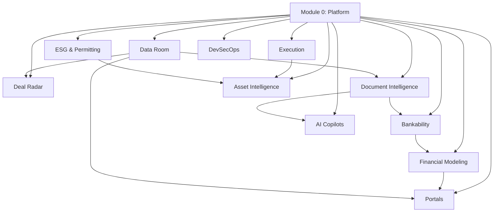

# Atlas Modules

Complete guide to all 12 Atlas platform modules.

## Table of Contents

1. [Module 0: Platform Foundations](#module-0-platform-foundations)
2. [Module 1: Deal Radar](#module-1-deal-radar)
3. [Module 2: Relationship Intelligence](#module-2-relationship-intelligence)
4. [Module 3: Document Intelligence](#module-3-document-intelligence)
5. [Module 4: Bankability Scoring](#module-4-bankability-scoring)
6. [Module 5: Financial Modeling](#module-5-financial-modeling)
7. [Module 6: Data Room](#module-6-data-room)
8. [Module 7: Execution Digital Twin](#module-7-execution-digital-twin)
9. [Module 8: Asset Intelligence](#module-8-asset-intelligence)
10. [Module 9: ESG & Permitting](#module-9-esg--permitting)
11. [Module 10: Portals](#module-10-portals)
12. [Module 11: AI Copilots](#module-11-ai-copilots)
13. [Module 12: DevSecOps](#module-12-devsecops)

---

## Module 0: Platform Foundations

**Path:** `/admin`  
**Files:** `src/lib/auth/`, `src/lib/services/`, `src/lib/db/`

### Overview

The foundation layer provides multi-tenancy, authentication, authorization, and platform-wide services that all other modules depend on.

### Architecture

```
Organization (tenant)
  └─ Workspace (project grouping)
       └─ Portfolio (individual deal)
```

### Components

#### Authentication (`src/lib/auth/`)

| File | Purpose |
|------|---------|
| `jwt.ts` | JWT token generation and verification (HS256) |
| `password.ts` | Password hashing with bcrypt (12 rounds) |
| `mfa.ts` | TOTP-based MFA with otpauth library |
| `session.ts` | Session management with SHA-256 token hashing |
| `middleware.ts` | Request authentication and token refresh |

**Token Lifecycle:**
- Access tokens: 15 minutes (short-lived for security)
- Refresh tokens: 7 days (rotated on each refresh)
- Sessions are tracked and can be revoked individually or globally

#### Authorization

| File | Purpose |
|------|---------|
| `rbac.ts` | Role-Based Access Control |
| `abac.ts` | Attribute-Based Access Control |

**Organization Roles:**
- `owner` - Full access including delete and billing
- `admin` - Manage members, workspaces, SSO
- `member` - Create and edit workspaces/portfolios
- `viewer` - Read-only access
- `billing` - Billing management only

**Workspace Roles:**
- `admin` - Full workspace control
- `editor` - Create and edit portfolios
- `viewer` - Read-only access

**ABAC Policies:**
- Stored per-organization in database
- Deny-first evaluation (deny policies always win)
- Conditions use dot-path matching (e.g., `user.orgRole`)
- Priority-ordered evaluation

#### Services (`src/lib/services/`)

| Service | Purpose |
|---------|---------|
| `audit.ts` | Central audit log for all CRUD operations |
| `notifications.ts` | User notification system |
| `tasks.ts` | Task management and assignment |
| `events.ts` | In-process event bus for side effects |

#### Database (`src/lib/db/`)

- SQLite with WAL mode for concurrent reads
- Foreign keys enforced
- PostgreSQL-ready schema (UUIDs, ISO timestamps)

### Key Functions

```typescript
// Generate JWT tokens
generateTokens(payload: TokenPayload): Promise<TokenSet>

// Verify access token
verifyAccessToken(token: string): Promise<JWTPayload & TokenPayload>

// Check organization permissions
hasPermission(role: OrgRole, permission: Permission): boolean

// Evaluate ABAC policies
evaluateAbacPolicies(orgId: string, context: EvalContext): AbacResult
```

---

## Module 1: Deal Radar

**Path:** `/deal-radar`  
**Files:** `src/lib/opportunity-store.ts`, `src/lib/scoring.ts`

### Overview

The origination command center for identifying, triaging, and tracking investment opportunities through the pipeline.

### Features

- **Pipeline Management**: Track deals from origination to close
- **Score-Based Triage**: Automatic scoring for prioritization
- **Watchlists**: Custom filters for monitoring opportunities
- **Committee Packs**: Generate investment committee materials

### Data Model

```typescript
interface Opportunity {
  id: string;
  name: string;
  sector: string;
  stage: 'origination' | 'screening' | 'diligence' | 'committee' | 'execution' | 'closed';
  geography: string;
  sponsor: string;
  debtAskUsdM: number;
  score: number;
  status: 'active' | 'on_hold' | 'passed' | 'won' | 'lost';
  watchlist: string[];
  createdAt: string;
  updatedAt: string;
}
```

### Scoring Algorithm

The scoring engine (`src/lib/scoring.ts`) calculates opportunity attractiveness based on:

1. **Sector fit** - Alignment with investment thesis
2. **Stage maturity** - Development readiness
3. **Sponsor quality** - Track record assessment
4. **Deal size** - Within target range
5. **Risk factors** - Red flag detection

---

## Module 3: Document Intelligence

**Path:** `/documents`  
**Files:** `src/lib/document-intelligence/`

### Overview

Automated document processing pipeline for ingestion, classification, entity extraction, and evidence card generation.

### Pipeline Stages

```
Upload → Classification → OCR → Entity Extraction → Chunking → Evidence Cards → Knowledge Graph
```

### Components

| File | Purpose |
|------|---------|
| `pipeline.ts` | Core document processing pipeline |
| `service.ts` | High-level document operations |
| `store.ts` | Document dataset persistence |
| `seed.ts` | Demo data generation |

### Key Functions

```typescript
// Ingest documents with auto-classification
ingestDocuments(inputs: IngestRequestDocument[]): Promise<IngestResult>

// Search with entity-aware queries
listDocuments(filters: { query?: string; source?: string; status?: string })

// Get evidence cards with citations
listEvidence(query?: string): Promise<EvidenceCard[]>

// Update human review status
updateHumanReview(input: ReviewInput): Promise<DocumentRecord>
```

### Document Categories

- `technical` - Technical reports, studies
- `legal` - Contracts, agreements
- `financial` - Models, statements
- `regulatory` - Permits, filings
- `esg` - Environmental/social assessments
- `commercial` - PPAs, offtake agreements

### Evidence Cards

Evidence cards are atomic facts extracted from documents with:

- **Statement**: The factual claim
- **Risk level**: low | medium | high
- **Citations**: Line-level references to source documents
- **Tags**: Searchable metadata

### Red Flags

Automatic detection of:
- Missing required clauses
- Inconsistent data points
- Expired documents
- Compliance gaps

---

## Module 4: Bankability Scoring

**Path:** `/bankability`  
**Files:** `src/lib/bankability/`

### Overview

Comprehensive underwriting assessment across six domains with scenario analysis and committee-grade narratives.

### Scoring Domains

| Domain | Weight | Description |
|--------|--------|-------------|
| Technical | 20% | Technology risk, performance guarantees |
| Commercial | 20% | Revenue certainty, counterparty credit |
| Financial | 20% | Returns, debt capacity, sensitivities |
| Regulatory | 15% | Permits, compliance requirements |
| ESG | 10% | Environmental, social, governance |
| Execution | 15% | EPC, schedule, change control |

### Components

| File | Purpose |
|------|---------|
| `engine.ts` | Core scoring calculations |
| `types.ts` | Type definitions |
| `data.ts` | Scoring model configuration |

### Key Functions

```typescript
// Full bankability evaluation
evaluateBankability(mode: ScenarioMode): BankabilityEvaluation

// Domain-level scoring
calculateDomainScores(context: EvaluationContext, scenario: ScenarioDefinition): DomainScore[]

// Risk dashboard
getRiskDashboard(): RiskDashboard

// Committee narrative generation
buildCommitteeNarrative(context, overallScore, domainScores): CommitteeNarrative
```

### Scenario Analysis

Three standard scenarios:
- **Base**: Expected case assumptions
- **Downside**: Stressed assumptions (-12% price, +14% capex)
- **Upside**: Optimistic assumptions (+4% price, +8% production)

### Red Flag Rules

Configurable rules that trigger automatic flags:
- DSCR below threshold
- Missing permits
- Counterparty credit concerns
- Unresolved technical issues

---

## Module 5: Financial Modeling

**Path:** `/financial-modeling`  
**Files:** `src/lib/finance/`

### Overview

Project finance modeling with scenario libraries, stress testing, sensitivity analysis, and lender pack generation.

### Components

| File | Purpose |
|------|---------|
| `calculations.ts` | Core financial calculations |
| `templates.ts` | Template library (capex, opex, revenue) |
| `validation.ts` | Input validation |
| `types.ts` | Type definitions |
| `repository.ts` | Scenario persistence |
| `csv.ts` | CSV import/export |

### Key Metrics

| Metric | Description |
|--------|-------------|
| `dscr` | Debt Service Coverage Ratio |
| `leverageRatio` | Debt / EBITDA |
| `interestCoverage` | EBITDA / Interest |
| `projectIrr` | Internal Rate of Return |
| `equityMultiple` | Exit value / Equity invested |
| `fundingReadinessScore` | Overall readiness (0-100) |

### Covenant Definitions

```typescript
interface CovenantDefinition {
  minDscr: number;       // Minimum DSCR (e.g., 1.35x)
  maxLeverage: number;   // Maximum leverage (e.g., 6.0x)
  minIcRatio: number;    // Minimum interest coverage
}
```

### Sensitivity Analysis

Built-in stress shocks:
- Base case (no changes)
- Downside pricing (-12% price, +5% capex, +4% opex)
- Cost overrun (+14% capex, +8% opex)
- Upside throughput (+8% production, +4% price)

### Lender Pack

Auto-generated documentation including:
- Funding structure summary
- Key metrics and ratios
- Due diligence checklist
- Approval history audit trail
- Deterministic fingerprint for verification

---

## Module 6: Data Room

**Files:** `src/lib/services/data-room.ts`

### Overview

Virtual data room for secure document sharing with external parties, featuring granular access controls, watermarking, and collection-based organization.

### Features

- **Classification levels**: internal, confidential, restricted, external
- **Collection-based organization**: Group documents logically
- **Granular access grants**: Per-user, per-collection permissions
- **Watermarking**: Dynamic watermarks for downloaded documents
- **Audit trail**: Track all access and downloads

### Access Roles

| Role | Capabilities |
|------|-------------|
| `owner` | Full control including delete |
| `editor` | Upload and modify documents |
| `viewer` | View and download (if permitted) |
| `question_only` | Ask questions, no document access |

### Key Functions

```typescript
// Create a data room
createDataRoom(input: CreateDataRoomInput): DataRoom

// Add documents
addDataRoomDocument(input: AddDocumentInput): DataRoomDocument

// Grant access
grantDataRoomAccess(input: AccessGrantInput): AccessGrant

// Build watermark
buildWatermark(input: WatermarkInput): WatermarkResult

// Get complete snapshot
getDataRoomSnapshot(dataRoomId: string): DataRoomSnapshot
```

---

## Module 7: Execution Digital Twin

**Path:** `/execution`  
**Files:** `src/lib/execution/`

### Overview

Real-time project execution tracking with milestone management, cost control, issue workflows, and contractor scorecards.

### Components

| File | Purpose |
|------|---------|
| `service.ts` | High-level execution operations |
| `store.ts` | Execution data persistence |
| `types.ts` | Type definitions |
| `cost-control.ts` | Budget and EAC calculations |

### Digital Twin Model

```typescript
interface ExecutionTwin {
  projectName: string;
  budget: {
    approved: number;
    committed: number;
    spent: number;
    forecast: number;
    contingency: number;
  };
  schedule: {
    plannedStart: string;
    plannedEnd: string;
    forecastEnd: string;
    percentComplete: number;
  };
}
```

### Issue Categories

- **RFI** - Request for Information
- **NCR** - Non-Conformance Report
- **Punch** - Punch list items
- **Change** - Change order requests

### Change Order Workflow

```
Draft → Submitted → Under Review → Approved/Rejected → Implemented
```

### Key Functions

```typescript
// Get execution twin
getExecutionTwin(): ExecutionTwin

// Milestone management
listMilestones(status?: MilestoneStatus): Milestone[]
createMilestone(input: MilestoneInput): Milestone

// Issue management
listIssues(status?: IssueStatus, category?: IssueCategory): Issue[]
createIssue(input: IssueInput): Issue

// Change orders
createChangeOrder(input: ChangeOrderInput): ChangeOrder
advanceChangeOrder(id: string, status: ChangeOrderStatus, comment: string): ChangeOrder
```

---

## Module 8: Asset Intelligence

**Path:** `/assets`  
**Files:** `src/lib/assets/`

### Overview

Telemetry ingestion, anomaly detection, predictive maintenance, and asset performance analytics.

### Components

| File | Purpose |
|------|---------|
| `engine.ts` | Analytics and anomaly detection |
| `service.ts` | High-level asset operations |
| `store.ts` | Asset data persistence |
| `demo-data.ts` | Sample telemetry data |

### Connector Types

| Type | Description |
|------|-------------|
| `can_bus` | CAN bus protocol (vehicles, equipment) |
| `scada` | SCADA systems (industrial) |
| `erp` | ERP integration (SAP, Oracle) |
| `manual` | Manual data entry |

### Telemetry Metrics

- `utilization` - Asset utilization percentage
- `fuel_burn` - Fuel consumption rate
- `energy_draw` - Power consumption
- `temperature` - Operating temperature
- `vibration` - Vibration levels
- `throughput` - Production throughput
- `revenue` - Revenue per hour

### Anomaly Detection

Automatic detection based on:
- Baseline deviation (>15% for efficiency, >12% degradation)
- Service interval pressure
- Historical patterns

### Predictive Maintenance

```typescript
// Calculate maintenance risk (0-1)
predictMaintenanceRisk(asset: Asset, anomalies: Anomaly[]): number

// Plan maintenance tasks
planMaintenance(dataset: AssetDataset, anomalies: Anomaly[]): MaintenanceTask[]
```

### Compliance Tracking

- Document requirements tracking
- Inspection readiness scoring
- Finding management
- Regulatory certification status

---

## Module 9: ESG & Permitting

**Path:** `/esg`  
**Files:** `src/lib/esg/service.ts`

### Overview

Comprehensive ESG management including permits, obligations, community relations, incidents, and regulatory reporting.

### Sub-Modules

#### Permit Register

Track permits with:
- Expiry date monitoring
- Alert windows (configurable days)
- Risk classification
- Renewal workflow

#### Obligation Tracker

Manage commitments from:
- Permit conditions
- Regulatory requirements
- Community agreements
- Local content commitments
- ESG policies

#### Community Relations

Handle:
- Issues and grievances
- Stakeholder engagement
- Sensitivity levels (standard, sensitive, restricted)
- Escalation workflows

#### Incident Management

Track ESG incidents with:
- Severity classification (low → critical)
- Automatic escalation rules
- Corrective action workflow
- Regulator notification tracking

#### Reporting Packs

Generate standardized reports:
- Regulatory filings
- Evidence bundles
- Permit registers
- Community reports
- Incident packs

### Key Functions

```typescript
// Permit management
createPermit(input: CreatePermitInput): Permit
getPermitDashboard(filter: PermitFilter): PermitDashboard

// ESG dashboard
getESGDashboard(filter: ESGFilter): ESGDashboard

// Incident management
createIncident(input: CreateIncidentInput): ESGIncident
getIncidentDashboard(filter: IncidentFilter): IncidentDashboard

// Report generation
createReportPack(input: CreateReportPackInput): ReportPack
```

---

## Module 10: Portals

**Path:** `/portals`  
**Files:** `src/lib/portals/store.ts`

### Overview

Role-based portal delivery for executives, investors, and operators with customized dashboards and exports.

### Portal Types

| Portal | Audience | Content |
|--------|----------|---------|
| Executive Cockpit | C-suite | High-level KPIs, alerts |
| Investor Portal | LPs, lenders | Returns, reports, documents |
| Operator Oversight | Field teams | Execution metrics, issues |

### Features

- Role-aware dashboard bundles
- Scheduled report delivery
- White-label branding
- Export formats (PDF, Excel, CSV)
- Notification preferences

---

## Module 11: AI Copilots

**Path:** `/ai`  
**Files:** `src/lib/ai/`

### Overview

AI-powered assistants for search, narrative generation, and diligence support with evidence grounding and guardrails.

### Components

| File | Purpose |
|------|---------|
| `service.ts` | AI service implementations |
| `registry.ts` | Prompt template management |
| `evaluations.ts` | Output quality evaluation |
| `prompts.ts` | Prompt templates |
| `store.ts` | Usage tracking |
| `types.ts` | Type definitions |

### Capabilities

#### Semantic Search
Evidence-grounded search across all Atlas data with citations.

#### Narrative Generation
Generate committee-grade narratives:
- Investment memos
- Board packs  
- Update notes

#### Diligence Copilot
Automated diligence support:
- Red flag detection
- Missing data prompts
- Evidence gap analysis

#### Workflow Assistant
Recommendations for:
- Next best actions
- Blocked items
- Due reminders

### Guardrails

Multiple security layers:
- Prompt injection detection
- PII redaction (SSN, credit cards, emails)
- XSS sanitization
- Reviewer mode controls (draft, review_required, evidence_only)

### Key Functions

```typescript
// Semantic search
semanticSearch(input: SearchInput): Promise<SearchResponse>

// Narrative generation
generateNarrative(input: NarrativeInput): Promise<NarrativeResponse>

// Diligence copilot
runDiligenceCopilot(input: DiligenceInput): Promise<DiligenceResponse>

// Workflow assistant
workflowAssistant(input: AssistantInput): Promise<AssistantResponse>
```

---

## Module 12: DevSecOps

**Path:** `/support-console`  
**Files:** `src/lib/ops/service.ts`

### Overview

Enterprise operations including release management, deployment automation, incident command, and observability.

### Components

#### Release Management

Track releases with:
- Version control
- Risk level assessment
- Approval workflow
- Rollback versioning
- Scheduled deployments

#### Deployment Automation

Manage deployments across:
- `dev` - Development environment
- `staging` - Pre-production testing
- `production` - Live environment
- `dr` - Disaster recovery

Deployment strategies:
- Blue-green
- Canary
- Rolling

#### Incident Command

Handle operational incidents:
- Severity classification (sev1 → sev4)
- Commander assignment
- Timeline tracking
- Customer updates
- Runbook linkage

#### Runbook Repository

Operational playbooks with:
- Step-by-step procedures
- Verification checklists
- Owner team assignment
- Severity scope

#### Test Suites

Track quality gates:
- Regression testing
- Performance testing
- Resilience testing
- Security scanning

### Key Functions

```typescript
// Release management
createRelease(input: ReleaseInput): ReleaseRecord
updateRelease(id: string, patch: Partial<ReleaseInput>): ReleaseRecord

// Deployment
createDeployment(input: DeploymentInput): DeploymentRecord
updateDeploymentStatus(id: string, status: DeploymentStatus): DeploymentRecord

// Incident management
createOpsIncident(input: OpsIncidentInput): OpsIncidentRecord
updateOpsIncident(id: string, patch: Partial<OpsIncidentInput>): OpsIncidentRecord

// Operations overview
getOpsOverview(orgId?: string): OpsOverview
```

### Observability

Built-in observability support:
- Dashboard templates (release health, service map)
- Alert definitions with routing
- OpenTelemetry tracing
- Error budget tracking

### Security Controls

- Dependency scanning (pnpm audit, osv-scanner, CodeQL)
- Secrets rotation tracking
- Supply chain controls (SBOM, lockfile drift, signed manifests)

---

## Module Dependencies



Each module is designed to work independently while sharing the platform foundation, enabling modular deployment and scaling.
