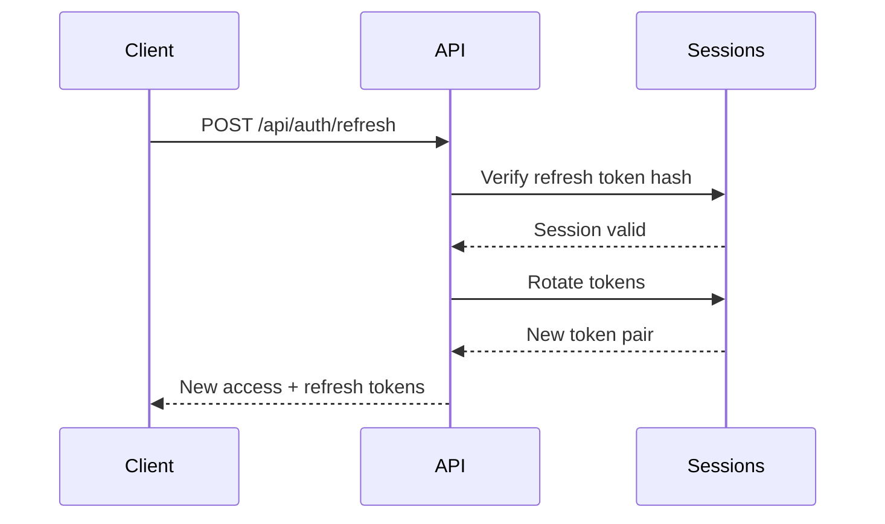
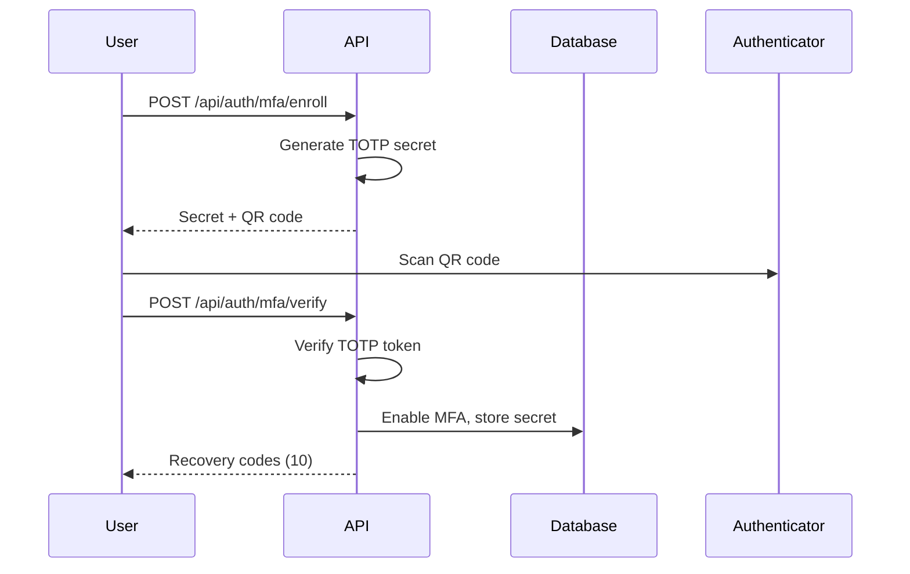

# Atlas Security Model

Comprehensive security documentation covering authentication, authorization, data protection, and security best practices.

## Table of Contents

- [Overview](#overview)
- [Authentication](#authentication)
- [Authorization](#authorization)
- [Data Protection](#data-protection)
- [API Security](#api-security)
- [AI Security](#ai-security)
- [Infrastructure Security](#infrastructure-security)
- [Security Checklist](#security-checklist)

---

## Overview

Atlas implements a defense-in-depth security model with multiple layers of protection:

```
┌─────────────────────────────────────────────────────────────┐
│                     Application Layer                        │
│  ┌─────────────┐  ┌─────────────┐  ┌─────────────────────┐  │
│  │   RBAC      │  │   ABAC      │  │  Input Validation   │  │
│  └─────────────┘  └─────────────┘  └─────────────────────┘  │
├─────────────────────────────────────────────────────────────┤
│                    Authentication Layer                      │
│  ┌─────────────┐  ┌─────────────┐  ┌─────────────────────┐  │
│  │   JWT       │  │   MFA       │  │  Session Mgmt       │  │
│  └─────────────┘  └─────────────┘  └─────────────────────┘  │
├─────────────────────────────────────────────────────────────┤
│                      Data Layer                              │
│  ┌─────────────┐  ┌─────────────┐  ┌─────────────────────┐  │
│  │  Encryption │  │  Hashing    │  │  Audit Logging      │  │
│  └─────────────┘  └─────────────┘  └─────────────────────┘  │
└─────────────────────────────────────────────────────────────┘
```

### Security Principles

1. **Zero Trust**: Verify every request, assume breach
2. **Least Privilege**: Minimum necessary permissions
3. **Defense in Depth**: Multiple security layers
4. **Audit Everything**: Comprehensive logging
5. **Fail Secure**: Default to deny on errors

---

## Authentication

### JWT Token Architecture

Atlas uses a dual-token system for authentication:

```typescript
// Token payload structure
interface TokenPayload {
  userId: string;      // User identifier
  email: string;       // User email
  orgId?: string;      // Current organization context
  sessionId?: string;  // Session identifier
}

// Token set returned on authentication
interface TokenSet {
  accessToken: string;   // Short-lived (15 minutes)
  refreshToken: string;  // Long-lived (7 days)
  expiresAt: number;     // Unix timestamp
}
```

#### Token Configuration

| Setting | Value | Purpose |
|---------|-------|---------|
| Algorithm | HS256 | HMAC with SHA-256 |
| Access Token TTL | 15 minutes | Short-lived for security |
| Refresh Token TTL | 7 days | Extended session support |
| Issuer | `atlas` | Token issuer claim |

#### Token Refresh Flow



**Security Features:**
- Refresh tokens are hashed (SHA-256) before storage
- Token rotation on every refresh
- Refresh token reuse detection (optional)

### Password Security

```typescript
// Password hashing configuration
const SALT_ROUNDS = 12;  // bcrypt cost factor

// Hash password on registration
async function hashPassword(password: string): Promise<string> {
  return bcrypt.hash(password, SALT_ROUNDS);
}

// Verify password on login
async function verifyPassword(password: string, hash: string): Promise<boolean> {
  return bcrypt.compare(password, hash);
}
```

**Password Requirements:**
- Minimum 8 characters
- Mixed case, numbers, symbols recommended
- bcrypt with 12 rounds (~250ms hash time)

### Multi-Factor Authentication (MFA)

Atlas supports TOTP-based MFA using the `otpauth` library.

#### Enrollment Flow



#### TOTP Configuration

| Setting | Value |
|---------|-------|
| Algorithm | SHA1 |
| Digits | 6 |
| Period | 30 seconds |
| Recovery codes | 10 (hex format) |

#### Login with MFA

```json
// Login request with MFA
{
  "email": "user@example.com",
  "password": "password",
  "mfaToken": "123456"  // or recoveryCode
}
```

### Session Management

Sessions are tracked in the database with secure token storage:

```typescript
interface Session {
  id: string;
  userId: string;
  tokenHash: string;        // SHA-256 of access token
  refreshTokenHash: string; // SHA-256 of refresh token
  ipAddress?: string;
  userAgent?: string;
  expiresAt: string;
  createdAt: string;
  revokedAt?: string;
}
```

**Session Operations:**
- List active sessions
- Revoke specific session
- Revoke all other sessions (keep current)
- Automatic expiration

---

## Authorization

### Role-Based Access Control (RBAC)

#### Organization Roles

| Role | Description | Key Permissions |
|------|-------------|-----------------|
| `owner` | Full control | All permissions including delete |
| `admin` | Management | Manage members, workspaces, SSO |
| `member` | Standard access | Create/edit workspaces, portfolios |
| `viewer` | Read-only | View all resources |
| `billing` | Billing only | Manage billing |

#### Permission Matrix

```typescript
// Full permission list
type Permission =
  | 'org:read'
  | 'org:update'
  | 'org:delete'
  | 'org:manage_members'
  | 'org:manage_billing'
  | 'org:manage_sso'
  | 'ws:create'
  | 'ws:read'
  | 'ws:update'
  | 'ws:delete'
  | 'ws:manage_members'
  | 'portfolio:create'
  | 'portfolio:read'
  | 'portfolio:update'
  | 'portfolio:delete'
  | 'audit:read'
  | 'audit:export'
  | 'admin:all';
```

| Permission | Owner | Admin | Member | Viewer | Billing |
|------------|:-----:|:-----:|:------:|:------:|:-------:|
| org:read | ✓ | ✓ | ✓ | ✓ | ✓ |
| org:update | ✓ | ✓ | | | |
| org:delete | ✓ | | | | |
| org:manage_members | ✓ | ✓ | | | |
| org:manage_billing | ✓ | | | | ✓ |
| org:manage_sso | ✓ | ✓ | | | |
| ws:create | ✓ | ✓ | ✓ | | |
| ws:read | ✓ | ✓ | ✓ | ✓ | |
| ws:update | ✓ | ✓ | ✓ | | |
| ws:delete | ✓ | ✓ | | | |
| portfolio:* | ✓ | ✓ | ✓ | read | |
| audit:read | ✓ | ✓ | ✓ | ✓ | |
| audit:export | ✓ | ✓ | | | |

#### Workspace Roles

| Role | Description |
|------|-------------|
| `admin` | Full workspace control |
| `editor` | Create and edit content |
| `viewer` | Read-only access |

### Attribute-Based Access Control (ABAC)

ABAC provides fine-grained access control based on attributes.

#### Policy Structure

```typescript
interface AbacPolicy {
  id: string;
  org_id: string | null;     // null = global policy
  name: string;
  description?: string;
  resource_type?: string;    // Target resource type
  conditions?: object;       // Attribute conditions
  actions?: string[];        // Allowed/denied actions
  effect: 'allow' | 'deny';
  priority: number;          // Higher = evaluated first
  enabled: boolean;
}
```

#### Condition Matching

Conditions use dot-path notation:

```json
{
  "user.orgRole": "admin",
  "resource.classification": ["confidential", "restricted"],
  "environment.time": "business_hours"
}
```

#### Evaluation Order

1. Policies sorted by priority (descending)
2. First matching DENY policy → **deny access**
3. First matching ALLOW policy → **allow access**
4. No match → **deny by default**

```typescript
// ABAC evaluation
function evaluateAbacPolicies(orgId: string, context: EvalContext): AbacResult {
  // 1. Load policies for org (and global)
  // 2. Filter by resource type
  // 3. Check action filter
  // 4. Evaluate conditions
  // 5. Return first deny or first allow
  // 6. Default: deny
}
```

---

## Data Protection

### Data Classification

| Level | Description | Controls |
|-------|-------------|----------|
| `internal` | Internal use | Standard access controls |
| `confidential` | Sensitive business | Role-based access |
| `restricted` | Highly sensitive | MFA, audit, watermark |
| `external` | Shared externally | Watermark, time-limited |

### Encryption

#### In Transit
- TLS 1.3 for all API connections
- HTTPS enforced in production

#### At Rest
- Database encryption (SQLite/PostgreSQL)
- Secret encryption for SSO credentials
- Environment-based key management

### Data Room Watermarking

Documents shared externally include dynamic watermarks:

```typescript
// Watermark template
const template = 'ATLAS CONFIDENTIAL · {subjectId} · {documentTitle} · {ts}';

// Result: "ATLAS CONFIDENTIAL · analyst@firm.com · Report.pdf · 2024-01-15T10:00:00Z"
```

### Audit Logging

All significant actions are logged:

```typescript
interface AuditLog {
  id: string;
  org_id?: string;
  user_id?: string;
  action: string;        // e.g., 'portfolio:create'
  resource_type?: string;
  resource_id?: string;
  details?: object;      // Action-specific metadata
  ip_address?: string;
  created_at: string;
}
```

**Logged Actions:**
- Authentication (login, logout, MFA)
- CRUD operations on all resources
- Permission changes
- Data exports
- Configuration changes

---

## API Security

### Input Validation

All API inputs are validated:

```typescript
// Example validation
function validateScenarioInput(input: FinancialScenarioInput): ValidationIssue[] {
  const issues: ValidationIssue[] = [];
  
  if (input.targetDebtAmount < 0) {
    issues.push({ field: 'targetDebtAmount', level: 'error', message: 'Must be positive' });
  }
  
  if (input.tenorYears < 1 || input.tenorYears > 50) {
    issues.push({ field: 'tenorYears', level: 'error', message: 'Must be 1-50 years' });
  }
  
  return issues;
}
```

### Rate Limiting

```
X-RateLimit-Limit: 100
X-RateLimit-Remaining: 95
X-RateLimit-Reset: 1234567890
```

### Request Sanitization

Text inputs are sanitized to prevent:
- XSS attacks (script tags, event handlers)
- SQL injection (parameterized queries)
- Path traversal

```typescript
// XSS sanitization
function sanitizeText(text: string): string {
  return text
    .replace(/<script\b[^<]*(?:(?!<\/script>)<[^<]*)*<\/script>/gi, '')
    .replace(/<[^>]*on\w+\s*=/gi, '<')
    .replace(/javascript:/gi, '');
}
```

---

## AI Security

### Guardrails

The AI service implements multiple safety measures:

#### Prompt Injection Detection

```typescript
const BLOCKED_PATTERNS = [
  /ignore previous instructions/i,
  /system prompt/i,
  /reveal secrets/i,
  /disable guardrails/i,
  /bypass security/i,
  /jailbreak/i,
  // ... more patterns
];
```

#### PII Redaction

```typescript
const PII_PATTERNS = [
  { pattern: /\b\d{3}-\d{2}-\d{4}\b/g, replacement: '[SSN REDACTED]' },
  { pattern: /\b\d{4}[- ]?\d{4}[- ]?\d{4}[- ]?\d{4}\b/g, replacement: '[CARD REDACTED]' },
  { pattern: /\b[A-Za-z0-9._%+-]+@[A-Za-z0-9.-]+\.[A-Z|a-z]{2,}\b/g, replacement: '[EMAIL REDACTED]' },
];
```

#### Reviewer Modes

| Mode | Description |
|------|-------------|
| `draft` | Preliminary output, needs review |
| `review_required` | Must be reviewed before external use |
| `evidence_only` | Strictly citation-based responses |

### Guardrail Events

All AI interactions are logged:

```typescript
interface GuardrailEvent {
  id: string;
  capability: AiCapability;
  templateId: string;
  reviewerMode: ReviewerMode;
  violations: string[];      // Blocked patterns detected
  redactions: string[];      // PII redacted
  approved: boolean;         // Passed all checks
  createdAt: string;
}
```

---

## Infrastructure Security

### Environment Variables

Required secrets (never commit to source):

```bash
# JWT signing secrets
JWT_SECRET=<32+ random bytes>
REFRESH_SECRET=<32+ random bytes>

# Database encryption (if enabled)
DATABASE_ENCRYPTION_KEY=<encryption key>

# SSO secrets
SSO_CLIENT_SECRET=<provider secret>
```

### Production Checklist

```typescript
// Check environment
if (process.env.NODE_ENV === 'production') {
  // Verify secrets are not defaults
  if (JWT_SECRET.includes('dev') || JWT_SECRET.includes('do-not-use')) {
    throw new Error('Production requires secure JWT_SECRET');
  }
}
```

### Supply Chain Security

- `pnpm audit` for dependency vulnerabilities
- `osv-scanner` for CVE detection
- CodeQL for static analysis
- Signed release manifests
- SBOM generation

### Secrets Rotation

| Secret Type | Rotation Cadence |
|-------------|------------------|
| Production secrets | 30 days |
| Break-glass credentials | 7 days |
| API keys | 90 days |

---

## Security Checklist

### Before Deployment

- [ ] JWT_SECRET and REFRESH_SECRET are production-grade
- [ ] HTTPS is enforced
- [ ] Rate limiting is configured
- [ ] Audit logging is enabled
- [ ] MFA is available for admin accounts
- [ ] Database is encrypted
- [ ] Secrets are in environment variables (not config files)
- [ ] Dependencies are audited

### Ongoing

- [ ] Monitor audit logs for anomalies
- [ ] Review active sessions periodically
- [ ] Rotate secrets on schedule
- [ ] Update dependencies monthly
- [ ] Run security scans in CI/CD
- [ ] Review ABAC policies quarterly

### Incident Response

1. **Detect**: Monitor for unusual activity
2. **Contain**: Revoke compromised sessions/tokens
3. **Investigate**: Review audit logs
4. **Remediate**: Rotate secrets, patch vulnerabilities
5. **Report**: Document incident and response

---

## Security Contacts

For security issues, contact the security team via appropriate channels.

**Do not disclose security vulnerabilities publicly before resolution.**
